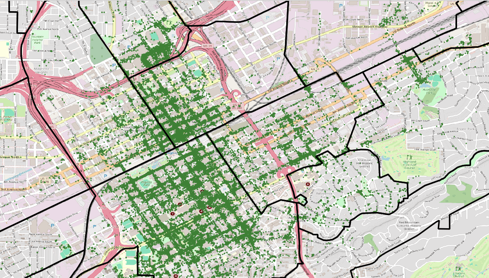

## Title

## Abstract

  
  &nbsp;&nbsp; 
  

## aaaa
aaaa

  

## Spatial-Temporal Network KDE
E-scooters pickups locations (in green) for the entire year, and the Spatial-Temporal Network KDE to understand the data distribution.

  

## Visualizing MATSim Results using <a href="https://simunto.com/via/">Via</a>

Click on the image below to open the YouTube video.

  
  
Urban traffic simulation with e-scooter services around 7:00 AM

 