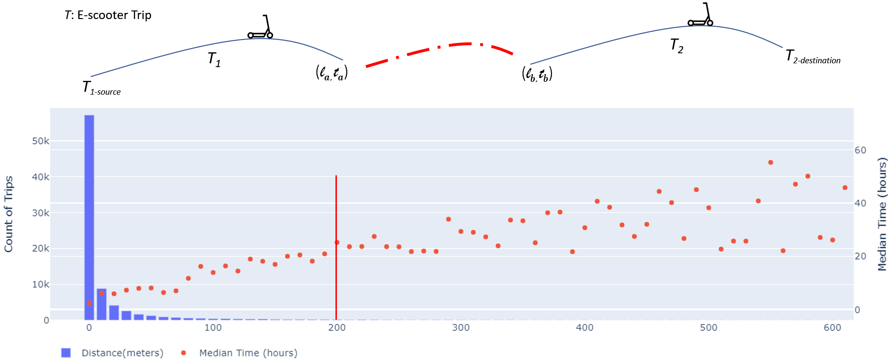

## Veo E-scooter Service in Birmingham, AL

In this study, we build a transportation simulation model for Birmingham, AL that supports Veo e-scooter rides. This study directly uses the field data from Veo’s 2021 micromobility pilot deployment in Birmingham, including the detailed ride information of all shared e-scooters from July 2021 to June 2022. The data is shared by Veo as a commitment of their pilot program to the City of Birmingham, where user identities are properly anonymized. 

We explored our dataset and found that rebalancing does occur. Below we show six consecutive rides conducted by the same e-scooter, and we can see that the 3rd ride starts at a location that is a designated parking corral of Veo, moved from where the 2nd ride ends. The e-scooter should have been moved for rebalancing/charging between these two rides.

  

We group all the rides by e-scooter vehicles, and for each e-scooter, we order its rides by time, and every pair of consecutive rides with the first ending at location *ℓa* and time *ta* and the next starting at location *ℓb* and time *tb* contributes a data point ⟨dist(*ℓa*, *ℓb*), (*tb* − *ta*)⟩, where dist(*ℓa*, *ℓb*) denotes the distance between *ℓa* and *ℓb*. The figure below shows a histogram of all the data points partitioned into bins of size 10 meters, and the median of (*tb* − *ta*) of all the data points in each bin is shown as an orange dot. We can see that most data points have dist(*ℓa*, *ℓb*) close to 0, and dist(*ℓa*, *ℓb*) may be slightly larger than 0 for some data points due to GPS localization precision error. However, there are bins that correspond to longer distances so the e-scooter vehicles are most likely moved, which can also be evidenced from the median time that generally increases with the bin distance. Note that rebalancing takes time so (*tb* − *ta*) tends to be longer for such bins. We consider all data point ⟨dist(*ℓa*, *ℓb*), (*tb* − *ta*)⟩ with dist(*ℓa*, *ℓb*) > 200 meters to be a rebalancing move from *ℓa* to *ℓb*, which should have a high confidence.

  

## Spatial-Temporal Network KDE
E-scooter pickup-locations (in green), and the Spatial-Temporal Network KDE to understand the data distribution.

  

## Visualizing MATSim Results using <a href="https://simunto.com/via/">Via</a>

Click on the image below to open the YouTube video.

  
  
Urban traffic simulation with e-scooter services around 7:00 AM

 